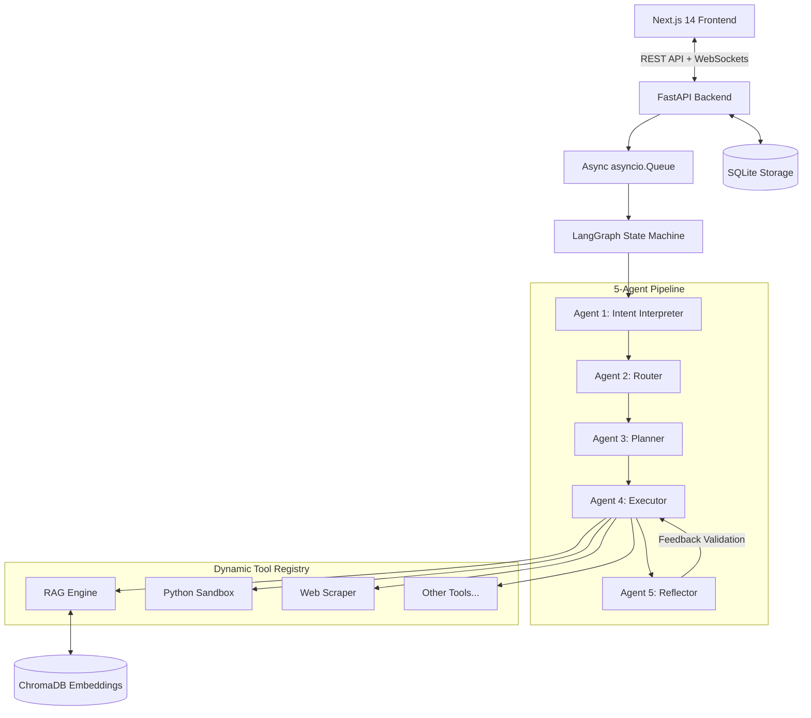

<div align="center">
  <h1 align="center">🤖 Agentic Workflow Engine (AWE)</h1>

  <p align="center">
    A production-grade, full-stack multi-agent orchestration platform. Go beyond simple chatbots with a 5-agent LangGraph pipeline capable of interpreting intent, planning, executing safe code, and reflecting—all streamed in real-time via WebSockets.
    <br />
    <br />
    <a href="#quick-start">Quick Start</a>
    ·
    <a href="#architecture-deep-dive">Architecture Deep Dive</a>
    ·
    <a href="#key-features">Features</a>
    ·
    <a href="#tech-stack">Tech Stack</a>
  </p>
</div>

---

## 🚀 The Vision: Beyond Simple Chatbots

**AWE** was designed to be a robust, full-stack intelligence platform where the AI doesn't just answer questions, but actually *thinks*, *plans*, *executes tools*, and *reflects* on the quality of its own output before responding. 

When a user submits a natural language request, the engine orchestrates 5 specialized AI agents working together in a pipeline. Every "thought", routing decision, and tool execution is streamed to the user in **real-time** over WebSockets, pairing a ChatGPT-like typing experience with fully transparent "agent thought process" visualization through a beautiful Next.js frontend.

---

## ✨ Key Features

- 🧠 **5-Agent LangGraph Pipeline:** A state machine sequence of specialized agents: *Intent Interpreter → Router → Planner → Executor → Reflector*.
- 🛠️ **9 Production-Ready Tools:**
  - `Code Executor` (Secure, AST-whitelisted Python sandbox with memory limits)
  - `Knowledge Retrieval` (Universal RAG for PDFs, DOCX, CSV, JSON, Markdown)
  - `Web Scraper` (httpx + BeautifulSoup text extraction)
  - `Data Analyzer` (Statistical math execution on datasets)
  - `Weather API`, `Calculator`, `Text Summarizer`, `Sentiment Analyzer`, `JSON Transformer`.
- 🛑 **Human-in-the-Loop (HITL):** High-risk, multi-step actions automatically pause the agent pipeline and actively request user approval via a UI modal before proceeding.
- ⚡ **Real-Time WebSocket Streaming:** Every word generated by the LLM and every internal status change is piped instantly to the UI alongside animated execution progress cards.
- 📚 **Resilient Universal RAG:** Upload documents, chunk texts intelligently via LangChain, embed into an in-process `ChromaDB`, and semantically search. Includes hallucination checkers.
- 🔋 **Enterprise Error Handling:** Integrated circuit breakers, auto-recovering Groq (Llama 3.3) API requests, and fallback routing for complete crash immunity.

---

## 🏗️ Architecture Deep Dive



### The Request Lifecycle
1. The user types a message in the **Next.js frontend**. 
2. The payload hits the **FastAPI REST endpoint**, which immediately drops it into an async task queue to free the HTTP thread.
3. A background worker picks the task up and initiates the **LangGraph state machine**.
4. The agent pipeline runs sequentially (interpreting intent, routing, planning tools). 
5. During execution, if a complex tool is selected, the loop pauses and sends a **Human-in-the-Loop** approval request down the persistent WebSocket.
6. Once approved, the tool runs (e.g., executing sandboxed AST code or querying ChromaDB for vector matches).
7. The LLM streams the synthesized answer character-by-character back over the WebSocket. Results and logs are permanently saved to **SQLite**.

---

## 💻 Tech Stack & Why It Was Chosen

| Layer | Technology | Engineering Decision |
|-------|-----------|----------------------|
| **Backend API** | FastAPI (Python) | Async-native design ensures the server can handle hundreds of concurrent WebSocket requests on a single underlying process without blocking. |
| **LLM Inference** | Groq (Llama-3.3-70B) | Chosen for its sub-second token generation speed—critical for real-time application feel. |
| **Orchestrator** | LangGraph | Preferred over LangChain agents due to its explicit StateMachine graph approach, allowing for complex loops (Executor <-> Reflector) and manual interruptions. |
| **Database** | SQLAlchemy + SQLite | Lightweight relational storage providing Type Safety over pure SQL. Drop-in replaceable with PostgreSQL for production. |
| **Vector Search** | ChromaDB | In-process document storage removes the need for expensive third-party vector cloud services while retaining fast Cosine similarity search. |
| **Frontend UI** | Next.js 14 (App Router) | Server components combined with a powerful localized router perfectly matches the modern React ecosystem. |
| **State** | Zustand | Global UI state without React Context re-render bloat—vital for components observing 60fps WebSocket streams. |
| **Styling** | Tailwind CSS & Framer | Rapid utility styling paired with robust, physics-based fluid animation tracking. |

---

## 🛠️ Quick Start

### Prerequisites
- Python 3.10+
- Node.js 18+
- Groq API Key

### 1. Clone & Install Dependencies
```bash
git clone https://github.com/kkrishhhh/AWE-core.git
cd AWE-core

# Backend Setup
python -m venv venv
source venv/bin/activate  # On Windows: venv\Scripts\activate
pip install -r requirements.txt

# Frontend Setup
cd frontend
npm install
```

### 2. Configure Environment Variables
Create a `.env` file in the root directory:
```env
GROQ_API_KEY=your_groq_api_key_here
DATABASE_URL=sqlite:///./awe.db
ENVIRONMENT=development
```

### 3. Run the Servers

**Terminal 1 (Backend):**
```bash
cd AWE-core
python -m uvicorn backend.api.main:app --host 0.0.0.0 --port 8001
```

**Terminal 2 (Frontend):**
```bash
cd AWE-core/frontend
npm run dev
```

The application will be available at `http://localhost:3000`.

---

## 🛡️ Edge Cases Handled

- **Infinite Loops & Memory Bombs in User Code:** The Python safe-executor checks the syntax tree (AST) locally before execution to block massive array allocations (`[0] * 10**9`) and enforces a strict 5-second computation timeout.
- **LLM Output Failures:** An automatic circuit breaker intercepts `429 Rate Limit` and broken JSON responses (via `json_repair`), pausing traffic and triggering internal retries before throwing terminal errors.
- **Lost WebSockets:** If the client disconnects mid-processing, the LangGraph backend naturally proceeds execution server-side. The user can simply reconnect later to fetch the resolved SQLite response. 
- **ChromaDB Thread Freezes:** Document parsing is explicitly offloaded out of the `asyncio` event loop into Python threadpools to prevent the server from freezing during dense PDF extraction.

---

> Built with ❤️ by an AI Engineer utilizing the Google Deepmind Agentic Architecture.
