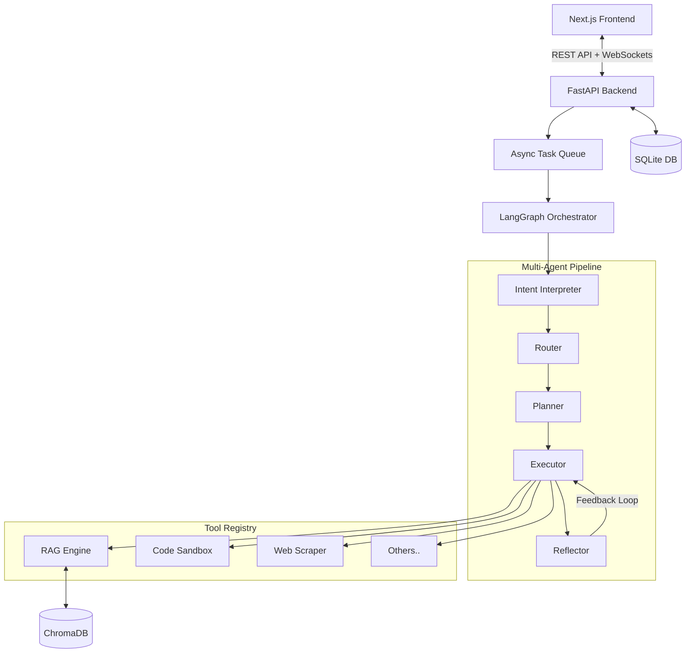

<div align="center">
  
  <h1 align="center">Agentic Workflow Engine (AWE)</h1>

  <p align="center">
    A production-grade, multi-agent AI orchestration platform featuring human-in-the-loop controls, real-time WebSocket streaming, and universal RAG capabilities.
    <br />
    <a href="#key-features"><strong>Explore the features »</strong></a>
    <br />
    <br />
    <a href="#quick-start">Quick Start</a>
    ·
    <a href="#architecture">Architecture</a>
    ·
    <a href="#tech-stack">Tech Stack</a>
  </p>
</div>

---

## 🚀 Overview

The **Agentic Workflow Engine (AWE)** goes beyond simple chatbots. It is a full-stack AI platform where specialized AI agents collaborate in a directed pipeline to **interpret intent, route tasks, plan strategies, execute tools, and reflect on outcomes**. 

Everything is streamed to the user in **real-time** over WebSockets, delivering a ChatGPT-like typing experience combined with transparent "agent thought process" visualization.

## ✨ Key Features

- 🧠 **5-Agent LangGraph Pipeline:** A state machine sequence of agents: *Intent Interpreter → Router → Planner → Executor → Reflector*.
- 🛠️ **9 Production-Ready Tools:**
  - `Code Executor` (Secure sandboxed Python execution)
  - `Web Scraper` (httpx + BeautifulSoup)
  - `Data Analyzer` (Statistical analysis on datasets)
  - `Knowledge Retrieval` (Universal RAG)
  - `Weather API`, `Calculator`, `Text Summarizer`, `Sentiment Analyzer`, `JSON Transformer`.
- 🛑 **Human-in-the-Loop (HITL):** High-risk actions automatically pause the agent pipeline and request user approval before execution.
- ⚡ **Real-Time WebSocket Streaming:** Every agent token is piped instantly to the UI alongside animated execution status cards.
- 📚 **Universal RAG Pipeline:** Upload and query against native PDFs, DOCX, CSV, JSON, and Markdown files powered by `ChromaDB` and HuggingFace Embbeddings.
- 🔋 **Resilient Architecture:** Bulletproof Groq (Llama 3.3 70B) calls backed by circuit breakers and auto-retries for rate-limit protection.

---

## 🏗️ Architecture



## 💻 Tech Stack

| Layer | Technology | Description |
|-------|-----------|-------------|
| **Backend** | Python & FastAPI | Async native REST + WebSockets server |
| **Orchestration** | LangGraph | State machine directed graph for multi-agent workflows |
| **LLM Provider** | Groq API | Blazing fast inference using Llama 3 |
| **Vector DB** | ChromaDB | In-process document vector storage |
| **Database** | SQLAlchemy + SQLite | Relational storage for tasks, messages, and analytics |
| **Frontend** | Next.js 14 | React framework with Server Components |
| **State** | Zustand | Ultra-lightweight global state management |
| **Styling** | Tailwind CSS & Framer Motion | Fluid animations, glassmorphism, modern UI |

## 🛠️ Quick Start

### Prerequisites
- Python 3.10+
- Node.js 18+
- Groq API Key

### 1. Clone & Install Dependencies
```bash
git clone https://github.com/yourusername/agentic-workflow-engine.git
cd agentic-workflow-engine

# Backend Setup
python -m venv venv
source venv/bin/activate  # On Windows: venv\Scripts\activate
pip install -r requirements.txt

# Frontend Setup
cd frontend
npm install
```

### 2. Configure Environment Variables
Create a `.env` file in the root directory:
```env
GROQ_API_KEY=your_groq_api_key_here
DATABASE_URL=sqlite:///./awe.db
ENVIRONMENT=development
```

### 3. Run the Servers

**Terminal 1 (Backend):**
```bash
cd agentic-workflow-engine
python -m uvicorn backend.api.main:app --host 0.0.0.0 --port 8001
```

**Terminal 2 (Frontend):**
```bash
cd agentic-workflow-engine/frontend
npm run dev
```

The application will be available at `http://localhost:3000`.

## 🛡️ Edge Cases Handled Successfully
- **LLM Output Fails:** Circuit breaker catches 429s (Rate Limits) and broken JSON, automatically resetting and retrying safely.
- **WebSocket Drops:** Tasks reliably finalize server-side via fallback DB polling if client disconnects mid-processing.
- **Malicious Code:** The Python code tool strips `import os`, `sys`, and detects memory-bomb definitions (e.g. `10**9`).
- **Huge Documents:** RAG truncates abnormally huge files at 100k chars to prevent ChromaDB ingestion lockups.

---

> Built with ❤️ by an AI Engineer utilizing the Google Deepmind Agentic Architecture.
