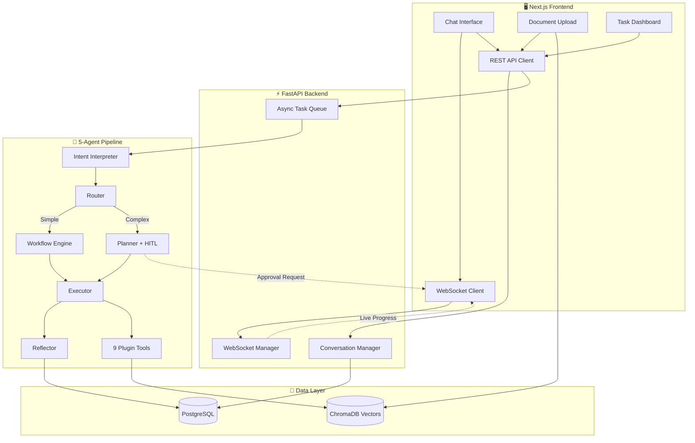

<div align="center">

# ⚡ Agentic Workflow Engine

**A production-grade AI agent orchestration platform with a 5-agent pipeline, 9 plugin tools, RAG knowledge base, human-in-the-loop approval, and real-time WebSocket streaming.**

[](https://python.org)
[](https://nextjs.org)
[](https://fastapi.tiangolo.com)
[](https://postgresql.org)
[](https://docker.com)
[](#-test-suite)

---

*Not just a chatbot — a complete AI orchestration platform where autonomous agents interpret, plan, execute, and self-evaluate tasks in real-time.*

</div>

---

## 🏗️ System Architecture



## 🤖 The 5-Agent Pipeline

Each user query flows through a pipeline of specialized AI agents, each with a distinct role:

| # | Agent | Role | What It Does |
|---|-------|------|-------------|
| 1 | **Intent Interpreter** | Understanding | Parses the user's message into structured intent — identifies task type, entities, required tools, and complexity level |
| 2 | **Router** | Decision Making | Routes to either the fast "workflow" path (single-tool tasks) or the full "agent" path (multi-step plans) based on complexity |
| 3 | **Planner** | Strategy | Generates a dependency-aware execution plan with ordered steps. Triggers **human-in-the-loop approval** for plans with 3+ steps |
| 4 | **Executor** | Action | Executes each plan step by selecting tools, extracting parameters via LLM, and running tools. Handles conversational messages directly |
| 5 | **Reflector** | Self-Evaluation | Evaluates progress, confidence, and quality. Can suggest plan modifications if results are unsatisfactory |

## 🔧 9 Plugin Tools

All tools extend a `BaseTool` abstract class and are **auto-discovered at startup** via the plugin registry — zero configuration needed to add new tools.

| Tool | Category | Description |
|------|----------|-------------|
| `calculator` | 🔢 Compute | AST-safe math evaluation — supports `+`, `-`, `*`, `/`, `**`, `%` with full operator precedence |
| `weather_api` | 🌤️ External API | Real-time weather data via Open-Meteo (temperature, wind, humidity, conditions) |
| `text_summarizer` | 🤖 LLM-Powered | AI-driven text summarization with configurable length |
| `web_scraper` | 🌐 External I/O | Async URL fetching with BeautifulSoup HTML extraction |
| `data_analyzer` | 📊 Compute | Statistical analysis: mean, median, mode, std dev, percentiles, IQR outlier detection |
| `code_executor` | 🔒 Sandboxed | AST-whitelisted Python expression sandbox — blocks `eval`, `exec`, `import`, private attrs |
| `json_transformer` | 🔄 Data Pipeline | JQ-like dot-notation JSON queries and transformations |
| `sentiment_analyzer` | 🎭 LLM-Powered | Multi-label sentiment classification with confidence scores |
| `knowledge_retrieval` | 📚 RAG | Semantic similarity search over ingested documents via ChromaDB |

## ✨ Key Features

### 🧠 RAG Pipeline (Retrieval-Augmented Generation)
Upload documents → automatic chunking with configurable overlap → ChromaDB vector embeddings → agents query via the `knowledge_retrieval` tool. Grounds AI responses in **your actual data** instead of hallucinating.

### 💬 Conversation Memory
Multi-turn sessions persist across messages. Previous context (last 10 messages) is injected into agent prompts, enabling natural follow-ups like *"Now analyze that data"* or *"Explain it simpler."*

### 🛡️ Human-in-the-Loop (HITL) Approval
Complex execution plans (3+ steps) automatically **pause and request user approval** via the WebSocket connection. Users can:
- ✅ **Approve** the plan to continue execution
- ❌ **Reject** with feedback for the agent to re-plan
- The frontend shows a real-time approval dialog with the full execution plan

### ⚡ Real-Time WebSocket Streaming
Each task gets a dedicated WebSocket channel that streams:
- Agent-by-agent progress (which agent is running, what it's doing)
- Tool execution results as they complete
- HITL approval requests
- Final results and error states

### 📊 Agent Analytics Dashboard
Built-in analytics endpoint tracks agent performance metrics: task completion rates, average execution times, tool usage frequency, and cost tracking.

## 🛠️ Tech Stack

| Layer | Technology | Purpose |
|-------|-----------|---------|
| **Frontend** | Next.js 14, React, TailwindCSS, Framer Motion | Responsive dashboard with animations |
| **State Management** | Zustand, TanStack Query | Client state + server cache |
| **API Server** | FastAPI, Pydantic v2, Uvicorn | High-performance async API |
| **Agent Orchestration** | LangGraph (stateful graph) | Agent pipeline state machine |
| **LLM Provider** | Groq SDK (Llama 3.3 70B) | Fast inference with structured output |
| **Database** | PostgreSQL, SQLAlchemy 2.0 | Conversations, tasks, execution logs |
| **Vector Store** | ChromaDB | Document embeddings + semantic search |
| **Logging** | structlog | JSON in production, colored in dev |
| **Deployment** | Docker, docker-compose | One-command full-stack deployment |

## 🚀 Quick Start

### Prerequisites
- Python 3.10+
- Node.js 18+
- PostgreSQL (or use Docker)
- A [Groq API key](https://console.groq.com) (free tier available)

### Option 1: Docker (Recommended)

```bash
# Clone the repository
git clone https://github.com/kkrishhhh/AWE-core.git
cd AWE-core

# Configure environment
cp .env.example .env
# Edit .env and add your GROQ_API_KEY

# Launch the full stack
docker-compose up --build
```

The app will be available at:
- **Frontend**: http://localhost:3000
- **API**: http://localhost:8001
- **API Docs**: http://localhost:8001/docs

### Option 2: Local Development

```bash
# Clone the repository
git clone https://github.com/kkrishhhh/AWE-core.git
cd AWE-core

# Configure environment
cp .env.example .env
# Edit .env and add your GROQ_API_KEY

# Backend setup
python -m venv backend/venv
backend/venv/Scripts/activate   # Windows
# source backend/venv/bin/activate  # macOS/Linux
pip install -r requirements.txt
python run_api.py

# Frontend setup (in a new terminal)
cd frontend
npm install
npm run dev
```

## 📡 API Reference

### Conversations
| Method | Endpoint | Description |
|--------|----------|-------------|
| `POST` | `/api/conversations` | Create a new conversation session |
| `GET` | `/api/conversations` | List all conversations (paginated) |
| `GET` | `/api/conversations/{id}` | Get conversation with full message history |
| `POST` | `/api/conversations/{id}/messages` | Send a message (triggers agent pipeline) |

### Tasks
| Method | Endpoint | Description |
|--------|----------|-------------|
| `POST` | `/api/tasks` | Create a standalone task |
| `GET` | `/api/tasks` | List tasks with status filtering + pagination |
| `GET` | `/api/tasks/{id}` | Get task details, interpreted intent, and result |
| `GET` | `/api/tasks/{id}/logs` | Get execution logs for a task |
| `POST` | `/api/tasks/{id}/approve` | Approve or reject a pending HITL plan |

### Documents & Tools
| Method | Endpoint | Description |
|--------|----------|-------------|
| `POST` | `/api/documents` | Ingest a document into the RAG knowledge base |
| `GET` | `/api/documents` | List all ingested documents with chunk counts |
| `GET` | `/api/tools` | List all registered tools with JSON schemas |

### System
| Method | Endpoint | Description |
|--------|----------|-------------|
| `GET` | `/health` | Deep health check (DB, queue, tools) |
| `GET` | `/api/analytics` | Agent performance analytics |
| `WS` | `/api/ws/tasks/{id}` | Real-time streaming + HITL approval channel |

## 🧪 Test Suite

**102 test cases** covering all 9 tools, agent schemas, RAG pipeline, database models, LLM client, and configuration — **99% pass rate**.

```bash
# Run the full test suite
python tests/test_comprehensive.py
```

| Category | Tests | Coverage |
|----------|-------|----------|
| Calculator | 15 | Addition, subtraction, multiplication, division, power, modulo, precedence, parentheses, negatives, floats, edge cases |
| Text Summarizer | 7 | Basic, short text, empty, paragraphs, unicode, special chars, schema |
| Sentiment Analyzer | 7 | Positive, negative, neutral, empty, mixed, single word, confidence |
| Data Analyzer | 7 | Numeric lists, comma-separated, JSON arrays, empty, single value, large datasets, schema |
| Code Executor | 7 | Arithmetic, power, list comprehension, division-by-zero, empty, math functions, strings |
| JSON Transformer | 7 | Select, nested paths, lists, invalid JSON, empty, complex objects, schema |
| Web Scraper | 5 | Valid URL, invalid URL, empty, fragments, schema |
| Weather API | 5 | Valid city, spaces, non-existent, empty, schema |
| Knowledge Retrieval | 4 | Search, empty query, long query, schema |
| Tool Registry | 8 | All 9 tools registered, individual lookups, unknown tool error, metadata |
| VectorStore + Chunker | 10 | Ingest, chunking, empty docs, search, listing, stats, overlap |
| Schemas + DB + LLM + Config | 20 | Pydantic models, DB models, LLM calls, structured output, config |

## 🏛️ Engineering Patterns

- **Plugin Architecture** — Tools auto-register via `BaseTool` subclass discovery; add a file → it's available
- **Centralized Config** — Single `Settings(BaseSettings)` class; environment-first, zero scattered `os.getenv()`
- **Circuit Breaker** — LLM client with exponential backoff, jitter, and failure threshold
- **Structured Logging** — JSON logs in production, colored console in development via structlog
- **Graceful Shutdown** — Cancels background workers, drains task queue, disposes DB connections
- **Connection Pooling** — PostgreSQL pool with configurable recycle, overflow, and timeout
- **Request Tracing** — `X-Trace-ID` and `X-Request-Duration-Ms` headers on every response

## 📁 Project Structure

```
agentic-workflow-engine/
├── backend/
│   ├── api/                        # FastAPI app, middleware, WebSocket manager
│   │   ├── main.py                 # 15+ endpoints, lifecycle, background worker
│   │   └── connection_manager.py   # WebSocket broadcast manager
│   ├── config.py                   # Centralized Pydantic Settings
│   ├── database/                   # SQLAlchemy models + connection pooling
│   ├── observability/              # Structured logging setup
│   ├── orchestration/
│   │   ├── agents/                 # 5 agents: interpreter, router, planner, executor, reflector
│   │   ├── graph.py                # LangGraph state machine definition
│   │   ├── worker.py               # Async task processor with NL summarization
│   │   └── workflows/              # Simple single-tool workflow engine
│   ├── rag/                        # ChromaDB vector store + text chunker
│   ├── resilience/                 # LLM client with circuit breaker pattern
│   ├── schemas/                    # Pydantic models for agents + API
│   └── tools/                      # 9 auto-discovered plugin tools
├── frontend/
│   ├── app/                        # Next.js app router pages
│   │   └── (dashboard)/            # Chat, Tasks, Documents, Analytics pages
│   ├── components/                 # Reusable UI components
│   ├── hooks/                      # useWebSocket custom hook
│   └── lib/                        # API client, store, utilities
├── tests/
│   └── test_comprehensive.py       # 102 test cases
├── Dockerfile                      # Backend production container
├── docker-compose.yml              # Full stack: API + DB + Frontend
├── .env.example                    # Environment variable template
├── requirements.txt                # Python dependencies
└── run_api.py                      # Application entrypoint
```

## 📄 License

This project is open source and available under the [MIT License](LICENSE).

---

<div align="center">

**Built with ❤️ using FastAPI, Next.js, LangGraph, and Groq**

</div>
